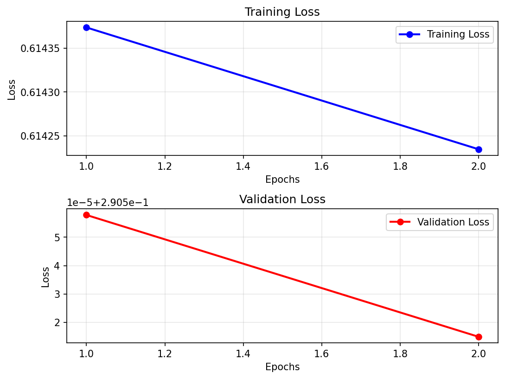
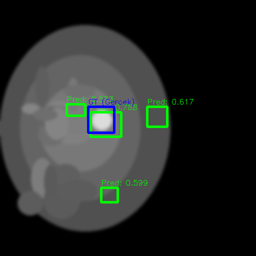
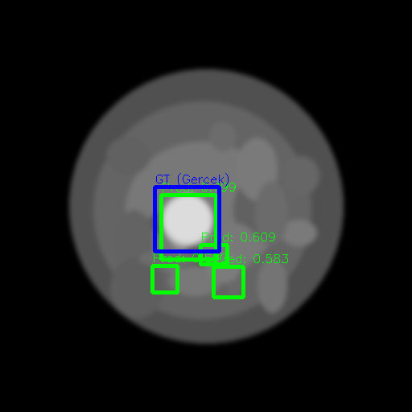

# CEN - Context Enhanced Network (MICCAI-2024)

> **Official Repository for CEN (Context Enhanced Network), presented at MICCAI-2024.**

This repository contains the PyTorch implementation of the **Context Enhanced Network (CEN)** for advanced mammography analysis. The network utilizes pairs of mammography views (MLO and CC) to establish a comprehensive context, ultimately enhancing classification performance through a robust fusion mechanism.

## Overview

The CEN framework employs a ViT-B/16 backbone (pretrained on ImageNet) to extract features from mammography screening exams. By combining the Craniocaudal (CC) and Mediolateral Oblique (MLO) views, the model leverages inter-view relationships, significantly improving the diagnostic robustness compared to single-view approaches.

This repository includes a specialized **Demo Environment** (`demo_train.py` & `demo_test.py`) specifically tailored for educational demonstrations, running seamlessly on limited hardware configurations by leveraging a toy dataset (`DEMO_DATA`).

## Features

- **Multi-View Fusion**: Intelligently combines MLO and CC views for enhanced contextual learning.
- **Pretrained Backbone**: Utilizes `ViT-B/16` for powerful feature extraction.
- **Educational Demo Mode**: Includes lightweight training and testing scripts designed to run fast on CPUs or basic GPUs with lower memory overhead.
- **Automated Visualization**: Generates loss curves and prediction visualisations out-of-the-box.

## Repository Structure

- `demo_train.py`: Lightweight training script for demonstrations.
- `demo_test.py`: Testing and evaluation script with visualizations.
- `models.py`: Network architecture definitions (including `MAX_model`).
- `data.py`: PyTorch `Dataset` implementations for loading mammography pairs.
- `calc_metrics2.py`: Utilities for calculating performance metrics.
- `create_toy_dataset.py`: Script to generate synthetic `DEMO_DATA`.
- `DEMO_DATA/`: Folder containing the toy dataset used in demo scripts.
- `demo_output/`: Directory where trained models (`.pth`), logs, and visualization plots are saved.

## Installation & Requirements

Ensure you have Python 3.8+ installed. The required packages include:

- `torch`
- `torchvision`
- `numpy`
- `Pillow` (PIL)
- `matplotlib`
- `tqdm`

You can install them via pip:

```bash
pip install torch torchvision numpy Pillow matplotlib tqdm
```

## Usage (Demo Mode)

### 1. Training

To train the model using the provided toy dataset, simply run:

```bash
python demo_train.py
```
This script runs a fast 2-epoch training loop, logging both training and validation loss, and saves the best model weights to `demo_output/`. A loss graph (`demo_loss_plot.png`) will also be generated automatically.

### 2. Testing & Evaluation

After training, evaluate the model performance on the test set:

```bash
python demo_test.py
```
This script loads the best model from `demo_output/` and generates prediction visualizations inside `demo_output/test_results/`.
## Visual Results & Outputs

The Context Enhanced Network provides automated visualizations to easily track training performance and model predictions on test cases.

### Training Performance
During training, the loss across epochs is plotted to verify model convergence.

<p align="center">
  
</p>
<p align="center"><em>Example loss plot over epochs showing consistent convergence.</em></p>

### Prediction Analysis
The test scripts generate direct visual overlays on the mammography images. In these outputs:
- 🟦 **Blue Boxes**: Ground truth bounding boxes.
- 🟩 **Green Boxes**: True Positive predictions (correctly identified regions by the CEN model).
- 🟥 **Red Boxes**: False Positive predictions (incorrectly identified regions).

Here is an example output from test patient `301`:

<p align="center">
  
  &nbsp; &nbsp; &nbsp;
  
</p>
<p align="center"><em>Left: MLO View | Right: CC View</em></p>

This side-by-side visualisation effectively demonstrates how the model utilizes context from both views to pinpoint regions of interest.

## Citation

If you find this code useful for your research, please refer to our MICCAI-2024 publication.

---
*Developed by Hakkı Keman.*
